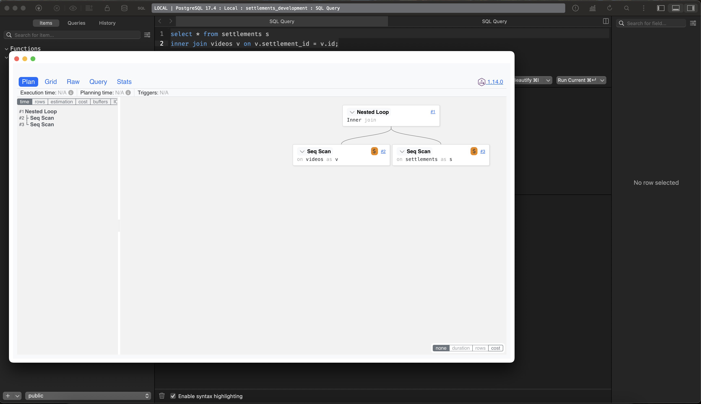

# PostgreSQL Visual Explain for TablePlus

A TablePlus plugin that provides visual explain plan visualization for PostgreSQL queries using PEV2.

> **Note:** I know the code is shit, it was basically put together in 2 hours a saturday night.



## Features

- Visualize PostgreSQL EXPLAIN plans using PEV2
- Support for PostgreSQL's JSON explain format
- Interactive visualization with detailed node information
- Query display alongside the plan

## Installation

1. Download the latest release from the [releases page](https://github.com/concernedrat/tableplus-pg-visual-explain/releases).
2. Double-click the `.tableplusplugin` file to install it in TablePlus.
3. Restart TablePlus if necessary.

## Usage

1. Connect to a PostgreSQL database in TablePlus.
2. Write or select a SQL query in the query editor.
3. Press `Ctrl+E` (or `Cmd+E` on macOS) or select "Visual Explain SQL" from the context menu.
4. The visual explain plan will be displayed in a new window.

## How It Works

The plugin executes the following SQL commands when you run it:

1. `SELECT VERSION() as version` - To get the PostgreSQL version
2. `EXPLAIN (FORMAT JSON) YOUR_QUERY` - To get the explain plan in JSON format

The JSON explain plan is then visualized using the PEV2 library, which provides an interactive visualization of the plan.

## Development

### Prerequisites

- Node.js (v21 or later)
- npm

### Setup

1. Clone the repository:
   ```
   git clone https://github.com/jorgemarizan/tableplus-pg-visual-explain.git
   cd tableplus-pg-visual-explain
   ```

2. Install dependencies:
   ```
   npm install
   ```

3. Build the plugin:
   ```
   npm run build
   ```

4. Package the plugin:
   ```
   npm run package
   ```

5. The packaged plugin will be in `PgVisualExplain.tableplusplugin.zip`.

### Project Structure

- `plugin/` - Contains the TypeScript files for the TablePlus plugin logic
- `ui/` - Contains the Vue.js components and UI logic
- `dist/` - Contains the compiled JavaScript files (generated after build)
- `tests/` - Contains test files for verifying the plugin
- `.github/workflows/` - Contains GitHub Actions workflow files for CI/CD

### Automated Releases

This project uses GitHub Actions to automatically build and release the plugin. Every time a commit is pushed to the main branch, the workflow will:

1. Build the plugin
2. Package it into a `.tableplusplugin.zip` file
3. Create a GitHub release with the packaged plugin attached

The release is automatically tagged and named using the version from package.json combined with the commit SHA. No manual tagging is required - just push your changes to the main branch, and a new release will be created automatically.

All releases will appear on the [releases page](https://github.com/concernedrat/tableplus-pg-visual-explain/releases).

### Testing

To test the plugin with sample data:

1. Run the verification script:
   ```
   node tests/verify-plugin.js
   ```

2. Install the packaged plugin in TablePlus.
3. Connect to a PostgreSQL database.
4. Run a query with the Visual Explain feature.

## License

MIT
